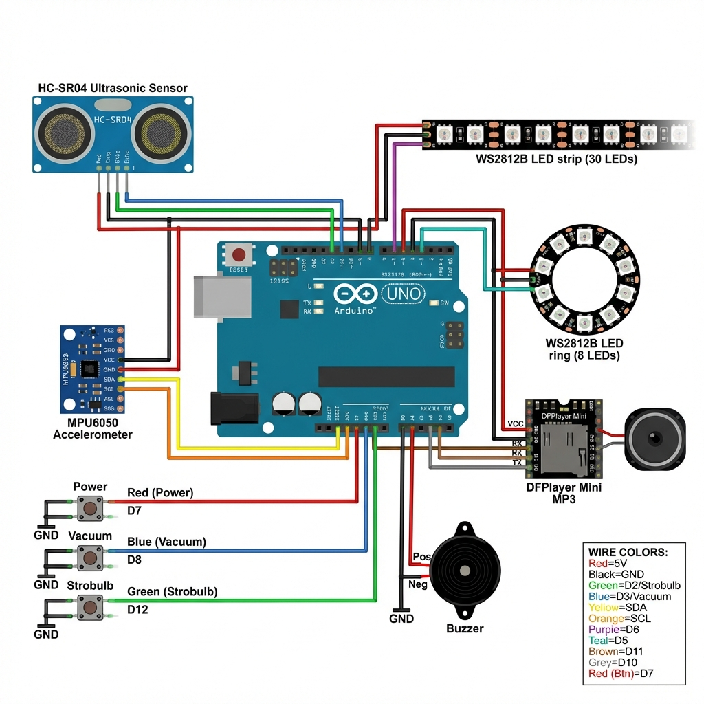

# Diagrama de Conexiones — Poltergust G-00 🦇⚡

## Diagrama Visual



---

## Esquema Detallado

```
                            ┌─────────────────────────────────────┐
                            │         ARDUINO UNO                 │
                            │                                     │
    ┌───────────┐           │  5V ●────────────────┬──────────────┼──── 5V Rail
    │  HC-SR04  │           │                      │              │
    │           │           │  GND ●───────────────┼──────────────┼──── GND Rail
    │ VCC ──────┼───────────┼── 5V                 │              │
    │ GND ──────┼───────────┼── GND                │              │
    │ TRIG ─────┼───────────┼── D2                 │              │
    │ ECHO ─────┼───────────┼── D3                 │              │
    └───────────┘           │                      │              │
                            │                      │              │
    ┌───────────┐           │                      │              │
    │  MPU6050  │           │                      │              │
    │           │           │                      │              │
    │ VCC ──────┼───────────┼── 3.3V               │              │
    │ GND ──────┼───────────┼── GND                │              │
    │ SDA ──────┼───────────┼── A4                 │              │
    │ SCL ──────┼───────────┼── A5                 │              │
    └───────────┘           │                      │              │
                            │                      │              │
    ┌───────────────────┐   │                      │              │
    │  ANILLO 8 LEDs    │   │                      │              │
    │  (Strobulb)       │   │                      │              │
    │                   │   │                      │              │
    │ 5V ───────────────┼───┼── 5V ────────────────┘              │
    │ GND ──────────────┼───┼── GND                               │
    │ DIN ──────────────┼───┼── D5                                │
    └───────────────────┘   │                                     │
                            │                                     │
    ┌───────────────────┐   │                                     │
    │  TIRA 30 LEDs     │   │                                     │
    │  (Tanque Goo)     │   │                                     │
    │                   │   │                                     │
    │ 5V ───────────────┼───┼── 5V (usar fuente externa si >10 LEDs)
    │ GND ──────────────┼───┼── GND                               │
    │ DIN ──────────────┼───┼── D6                                │
    └───────────────────┘   │                                     │
                            │                                     │
    ┌───────────────────┐   │                                     │
    │  DFPlayer Mini    │   │                                     │
    │                   │   │                                     │
    │ VCC ──────────────┼───┼── 5V                                │
    │ GND ──────────────┼───┼── GND                               │
    │ RX ───────────────┼─┬─┼── D10 (con resistor 1K)             │
    │ TX ───────────────┼─┼─┼── D11                               │
    │ SPK1 ─────────────┼─┼─┼──┐                                  │
    │ SPK2 ─────────────┼─┼─┼──┼── Amplificador → Altavoces       │
    └───────────────────┘ │ │  │                                  │
                          │ │  │                                  │
                     1K Ω ▼ │  │                                  │
                            │                                     │
    ┌───────────────────┐   │                                     │
    │  BUZZER Pasivo    │   │                                     │
    │                   │   │                                     │
    │ + ────────────────┼───┼── D9                                │
    │ - ────────────────┼───┼── GND                               │
    └───────────────────┘   │                                     │
                            │                                     │
    ┌───────────────────┐   │                                     │
    │  BOTONES          │   │                                     │
    │  (INPUT_PULLUP)   │   │                                     │
    │                   │   │                                     │
    │ Power ────────────┼───┼── D7 ──┐                            │
    │ Vacuum ───────────┼───┼── D8 ──┼── (otro pin a GND)         │
    │ Strobulb ─────────┼───┼── D12 ─┘                            │
    └───────────────────┘   │                                     │
                            │                                     │
    ┌───────────────────┐   │                                     │
    │  LED Estado       │   │                                     │
    │                   │   │                                     │
    │ + (con 220Ω) ─────┼───┼── D13                               │
    │ - ────────────────┼───┼── GND                               │
    └───────────────────┘   │                                     │
                            └─────────────────────────────────────┘
```

---

## Tabla de Conexiones Rápida

| Componente | Pin Arduino | Notas |
|------------|-------------|-------|
| HC-SR04 Trig | D2 | |
| HC-SR04 Echo | D3 | |
| Anillo LED Data | D5 | WS2812B |
| Tira LED Data | D6 | WS2812B |
| Buzzer + | D9 | PWM |
| DFPlayer RX | D10 | **Resistor 1KΩ en serie** |
| DFPlayer TX | D11 | |
| Botón Power | D7 | Otro pin a GND |
| Botón Vacuum | D8 | Otro pin a GND |
| Botón Strobulb | D12 | Otro pin a GND |
| LED Estado + | D13 | Resistor 220Ω |
| MPU6050 SDA | A4 | I2C |
| MPU6050 SCL | A5 | I2C |

---

## Alimentación

> ⚠️ **IMPORTANTE para los LEDs**

Los 30 LEDs WS2812B pueden consumir hasta **1.8A** a máximo brillo.
El Arduino UNO solo puede dar ~500mA por el pin 5V.

**Recomendación:**
```
Fuente 5V 3A ───┬─── 5V LEDs
                │
                └─── VIN Arduino (si la fuente es estable)
                     o alimentar Arduino por USB separado

GND común para todos los componentes
```

---

## Conexión DFPlayer con Amplificador

```
DFPlayer Mini          Amplificador         Altavoces
┌─────────────┐       ┌──────────────┐     ┌─────────┐
│         SPK1├───────┤ IN+          │     │         │
│         SPK2├───────┤ IN-      OUT+├─────┤ Speaker │
│             │       │          OUT-├─────┤         │
│         GND ├───────┤ GND          │     └─────────┘
│         VCC ├───────┤ VCC (5V)     │
└─────────────┘       └──────────────┘
```

---

## Conexión Botones (INPUT_PULLUP)

```
    D7/D8/D12                GND
        │                     │
        │    ┌─────────┐      │
        └────┤  BOTÓN  ├──────┘
             └─────────┘
             
Al presionar: pin lee LOW
Sin presionar: pin lee HIGH (interno)
```

---

## Librería Necesarias (Arduino IDE)

1. **FastLED** — LEDs WS2812B
2. **DFRobotDFPlayerMini** — Audio
3. **Wire** — I2C (incluida)
4. **SoftwareSerial** — DFPlayer (incluida)
